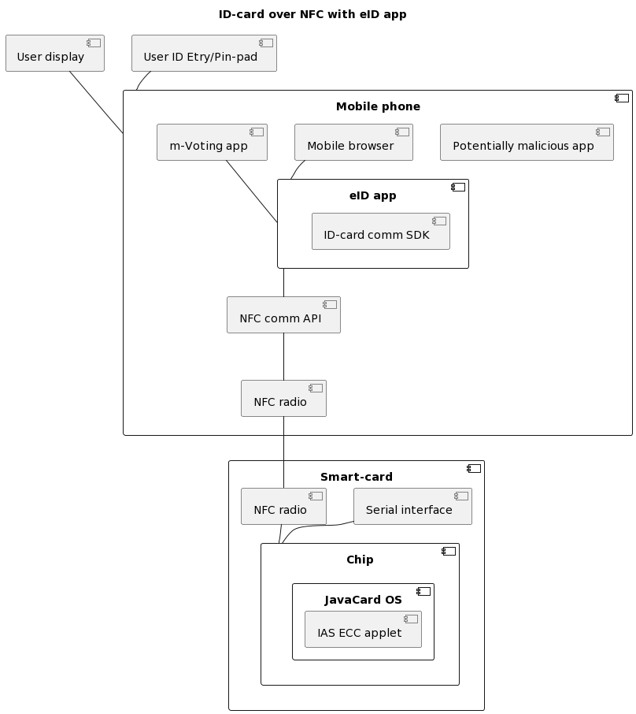
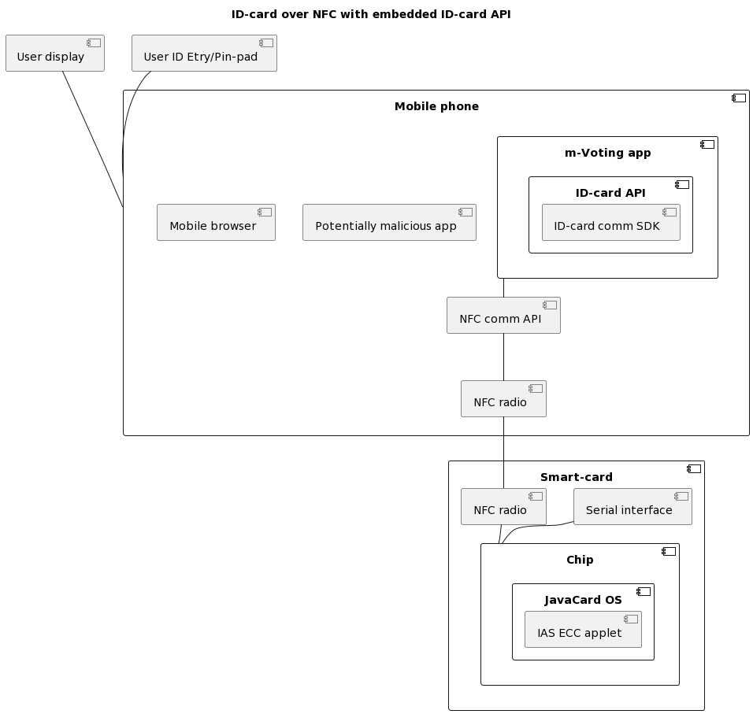
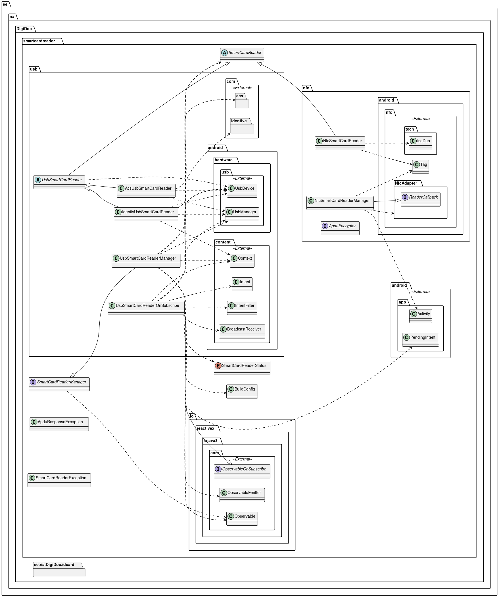
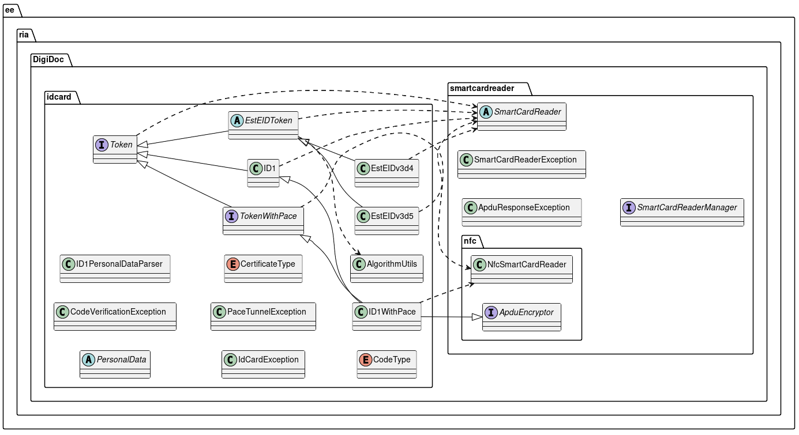
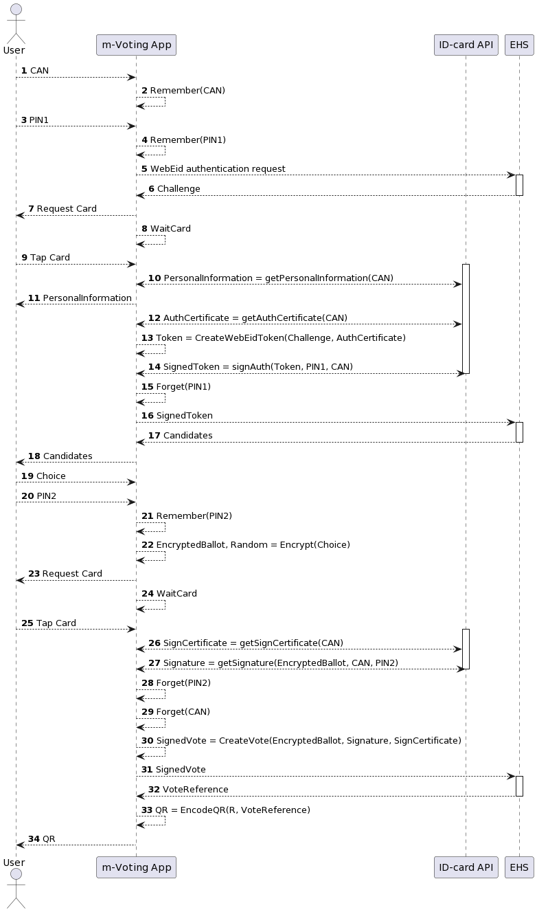

# NFC-ID teek - arhitektuuridokument

[TOC]

## Ülevaade

NFC-ID teek pakub võimalust kasutada ID-kaardi autentimis- ja signeerimisfunktsionaalsust üle NFC liidese. Teegist on kaks versiooni - Android ja iOS platvormile.

NFC-ID teek ei ole mõeldud avalikuks kasutamiseks. Tegemist on tehnilise taseme teegiga, mis delegeerib kasutajaga suhtlemise rakendusele. Pikema aja jooksul ei ole ohutu võimaldada lõppkasutajal sisestada oma ID-kaardi PIN-koode igasse mobiilirakendusse. ID-kaardiga suhtluseks, usaldusväärse kasutajaliidese ning muude vajalike funktsioonide jaoks on vajalik luua tulevikus spetsiaalne mobiilirakendus. Selline lahendus võimaldab edaspidi mobiilirakendust kiiremini uuendada ning rünnete korral kaitsemeetmeid kohandada ja täiendada.

NFC-ID teek on arendatud m-valimiste projektis lähtudes vajadusest kasutada ID-kaarti m-valijarakenduses.

## Arhitektuursed eesmärgid - kontekst, eeldused ja sõltuvused

Eesti ID-kaardil on olemas NFC liides, mille vahendusel on kättesaadav kogu ID-kaardi funktsionaalsus. Android ja iOS nutiseadmetel on sageli olemas NFC liides, mis võimaldaks ID-kaarti nendel seadmetel kasutada.

ID-kaart on juba kasutatav Android ja iOS nutiseadmetel, hetkel nõuab see nutiseadme USB porti kiipkaardilugeja ühendamist, mis on kasutajatele ebamugav. Rakendused, mis praegu ID-kaarti kasutavad, peavad ise realiseerima suhtlusprotokolli ID-kaardiga USB kaardilugeja ja APDU tasandil.

Eesti ID-kaardi kasutamiseks üle NFC liidese on tehtud teostatavusuuring, mille põhjal ei ole takistusi NFC lubamiseks. - [Analysis of the Possibility to Use ID1 Card's NFC Interface for Authentication and Electronic Signing](https://www.ria.ee/media/1350/download). Uuring kirjeldab ka võimalikku arhitektuuri NFC toe loomiseks, mis tähendab eraldi eID rakenduse loomist vältimaks olukorda, kus kolmandad osapooled lõppkasutajalt PIN koode küsima hakkavad.

m-valimiste projejkti raames on eesmärk luua tarkvarateek, mis võimaldab kasutada ID-kaardi funktsionaalsust nutiseadmes üle NFC liidese, süüvimata seejuures seadme ja kaardi suhtlusprotokollidesse (NFC, PACE, ID-kaardi APDUd). Selline teek on pikemas plaanis eelduseks eraldiseisva eID rakenduse loomiseks nutiplatvormidele ning annab lühemas plaanis võimaluse ID-kaarti valitud rakendustes kasutusele võtta.

Hetkel ID-kaarti kasutavate rakenduste hulgas on https://github.com/open-eid/MOPP-Android ja https://github.com/open-eid/MOPP-iOS. Nende rakenduste jaoks vajalik funktsionaalsus on mõnevõrra erinev m-valimiste vajadustest, samas on nende rakenduste lähtekoodis juba olemas ID-kaardiga suhtlemise abstraktsioonid (näiteks `ee.ria.DigiDoc.idcard.Token`), mida on mõistlik loodava teegi juures arvestada.

Otsides analooge väljastpoolt Eesti eID maastikku, leiame Yubikey tokenid - mitmerakenduselised USB tokenid, mille funktsionaalsus on kasutatav ka üle NFC liidese. Üheks paljudest rakendustest on PIV (*Personal Identity Verification*), mis on võrreldav ID-kaardiga. Yubikeyl on olemas näiterakendus ja teek mh. Android platvormile (https://github.com/Yubico/yubikit-android), mis kirjeldab võtmete kasutamist nii üle USB kui NFC liidese. Võrreldes Eesti rakendustega on siin täiendav abstraktsioon - suhtluskanal kaardiga võib olla USB või NFC.

## Arhitektuurselt olulised nõudmised

### Isikuandmete lugemine

NFC-ID teek peab võimaldama kaardilt isikuandmete lugemist. Minimaalselt vajalik informatsioon on:

-   Eesnimi
-   Perekonnanimi
-   Isikukood

### Kaardi haldamine

NFC-ID teek peab võimaldama PIN1 ja PIN2 loendurite lugemist.

ID-kaardi spetsifikatsiooni kohaselt on võimalik ka PUK loenduri lugemine ning PIN1, PIN2 ja PUK koodide muutmine. Need funktsionaalsused ei ole NFC-ID teegi skoobis.

### Sertifikaatide lugemine

NFC-ID teek peab võimaldama kaardilt lugeda autentimissertifikaati ja allkirjastamissertifikaati.

### Digitaalallkirjastamine

NFC-ID teek peab võimaldama eelnevalt räsitud andmete digitaalallkirjastamist. NFC-ID teek ei pane kitsendusi räsi pikkusele, s.t. toetatud on m.h. SHA-256, SHA-384 ja SHA-512

### Autentimine

NFC-ID teek peab võimaldama autentimisvõtme kasutamist, esmajärjekorras tuleb toetada [Web-eID](https://www.id.ee/en/article/web-eid/) autentimismehhanismi väljakutsete signeerimist, TLS-CCA autentimine ei ole skoobis.

### Mittefunktsionaalsed nõudmised

#### Turvaline suhtluskanal

NFC-ID teek loob ID-kaardiga suhtlemiseks turvalise suhtluskanali kasutades PACE v2 protokolli ja kaardile trükitud CAN koodi.

#### Ühilduvus olemasolevate teekidega

NFC-ID teegi arendamisel nii Android kui iOS platvormile tuleb hinnata võimalust taaskasutada MOPP rakenduste arendamisel juba tehtud tööd / võimalust pakkuda neile rakendustele ühilduvat liidest ID-kaardi kasutamiseks üle NFC. See võib mõjutada näiteks asünkroonset suhtlemist võimaldavate mehhanismide valikut.

Android platvormil tuleb arvestada, et teegi klientrakendused võivad olla arendatud nii Kotlinis kui Javas.

## Otsused

### Skoop

NFC-ID teek on vahesamm teel eraldiseisva eID rakenduse suunas. Teegi kasutamine eeldab selle kompileerimist ja levitamist klientrakenduse osana.

### Lahtiütlused

NFC-ID teek ei realiseeri kõiki ID-kaardi poolt toetatud funktsionaalsuseid, täpsemalt peame silmas järgmist:

-   PIN/PUK koodide muutmine
-   Dekrüpteerimine

NFC-ID teek vahendab suhtlust ID-kaardiga. Sisendandmete ettevalmistamine (nt. räsimine) on rakenduste ülesanne, väljundandmete pakendamine (nt. ASiCe) on rakenduste ülesanne.

### Autentimine

ID-kaardiga autentimisel võime eristada kahte viisi autentimiseks - TLS-CCA ja Web-eID

#### TLS-CCA autentimine

TLS-CCA korral autenditakse klient- ja serverrakenduse vaheline TLS seanss ka kliendipoolselt kasutades avaliku võtme sertifikaati. Üldjuhul on TLS-CCA rakendamisel ka serverrakendus autenditud, ehk seanss on mõlemapoolselt autenditud.

TLS-CCA eeldab, et TLS protokolli realiseeriv raamistik oskab kasutada mõnda sobivat signeerimismehhanismi signeerimaks usaldatud sertifikaadile vastava privaatvõtmega TLS seansi HandShake faasi sõnumite räsi. NFC-ID teegi kontekstis tähendab see, et TLS protokolli realiseerival raamistikul peab olema juurdepääs ID-kaardi autentimisvõtmega signeerimisele.

Android keskkonnas tähendab see, et NFC-ID kaart realiseerib JCA (*Java Cryptography Architecture*) vastavaid liideseid.

TLS-CCA kasutamine võimaldab nt. EHS\'iga suhelda ilma serveripoolseid muudatusi tegemata.

#### Web-eID autentimine

Alternatiivse autentimismehhanismina saab kaaluda Web-eID protokolli. Kuigi TLS-CCA on turvaline lahendus autentimiseks, kaasnevad sellega keerukused veebikeskkonnas rakendamisel, kus ligipääs riistvaralistel seadmetel paiknevatele privaatvõtmetele ei ole ei lihtne ega ühetaoline. Sellises keskkonnas on mõistlik kasutada Web-eID protokolli (https://github.com/web-eid/web-eid-system-architecture-doc), kus TLS seanss klient- ja serverrakenduse vahel on autenditud vaid serveripoolselt ning kliendi autentimine toimub juba TLS seansi sees.

Web-eID rakendamisel kaasnevad MITM ja Session-hijacking riskid, mille vastu üldotstarbeliste leevenduste leidmine ei ole hetke teadmisest lähtudes võimalik. Samas on Web-eID turvatase võrreldav mobiil-ID ja SmartID turvatasemega.

Kitsamalt EHS kontekstis on autentimise roll ning protokolli ülesehitus selline, et Web-eID kasutamisele vastuväiteid ei ole.

Seega tuleb NFC-ID teegis esmajärjekorras realiseerida võimekus Web-eID vastussõnumite signeerimiseks.

## Abstraktsioonid ja arhitektuursed mehhanismid

### Android

#### Meetod NFC-tagide tuvastamiseks.

Android platvormi NFC tugi on kirjeldatud [platvormi dokumentatsioonis](https://developer.android.com/develop/connectivity/nfc). Teek kasutab ID-kaardi tuvastamiseks üle NFC *reader/writer* moodi (`android.nfc.NfcAdapter.enableReaderMode`). NFC suhtlus on alati seotud konkreetse `Activity` instantsiga ning NFC *tagi* (`android.nfc.Tag`) tuvastamine käib *callback* meetodi abil (erinevalt nt. `enableForegroundDispatch` meetodist), eeldades ID-kaardilt NfcA tehnoloogia kasutamist. Sobiva kaardi tuvastamisel luuakse *tagi* abil ISO-DEP (ISO 14443-4) tüüpi ühendus (`android.nfc.tech.IsoDep`), mida kasutatakse juba ID-kaardi APDU protokollisõnumite vahetamiseks. 

#### Ühilduvus RIA MOPP-Android rakendusega

RIA MOPP-Android rakendus realiseerib APDU protokolli 3 erineva ID-kaardi versiooni jaoks, neist IDEMIA ID1 kaart toetab ka NFC liidest. RIA MOPP-Android rakendus kasutab kaarte USB porti ühendatud kiipkaardilugeja abil ning võimaldab ID-kaardi funktsionaalsust kasutada nutiseadmest. On mõistlik taaskasutada antud rakenduse arhitektuuri:

* ID-kaardi APDU protokoll on spetsiifline protokoll, mille korduvimplementeerimine ei ole mõttekas. Kasulik on ära kasutada kogunenud teadmist ID-kaardiga suhtlemise kohta, mis alati ei ole saadaolevast dokumentatsioonist üheselt leitav.
* Lähtudes olemasolevatest liidestustest on lihtsam tagada NFC toe rakendatavus nt. RIA MOPP-Android rakendusse.

Tuleb pidada silmas, et 100% ühilduvuse saavutamine ei osutunud võimalikuks. Lisamaks NFC tuge RIA MOPP-Android rakendusest eraldatud teekidesse oli vajalik nende teekide mõningane refaktoreerimine.

#### smart-card-reader-lib

`smart-card-reader-lib` on RIA MOPP-Android päritolu. Algselt oli tegu teegiga, mis pakkus abstraktset `SmartCardReader` liidest ning `SmartCardReaderManager` klassi, mis Android API vahendusel USB ühendusi monitooris ning ID-kaardi ühendumise tuvastas. Teek sisaldas tuge ACS ja Identiv kaardilugejatele.

NFC liidese loomise käigus refaktoreeriti USB liidese spetsiifiline kood eraldi alamteeki ning selle kõrvale loodi NFC spetsiifiline alamteek, mis realiseerib klassid `NfcSmartCardReaderManager` ja `NfcSmartCardReader`. Mõlemad alamteegid - USB ja NFC - jagavad `SmartCardReader` abstraktsiooni ja erindeid. Tulenevalt tehnoloogilistest eripäradest ei osutunud otstarbekaks haldurklasside - `UsbSmartCardReaderManager` ja `NfcSmartCardReaderManager` vaheline abstraktsioonide jagamine. Ilmselt on ka teegi kasutajal oluline teha vahet USB ja NFC liidese vahel, kuna need tingivad ka erinevad kasutajakogemused - USB kaardilugejas võib kaart olla pikalt ning rakendus saab sellega suhelda. NFC ühenduse hoidmine eeldab kasutajalt füüsilist pingutust ning kaardiga suhelda saab alles peale PACE tunneli loomist.

Klass `NfcSmartCardReaderManager` on liidestumise alguspunkt integreerijale - selle klassi instantsi abil tuvastatakse seadme NFC toe olemasolu ning olek ja reageeritakse NFC võimelise ID-kaardi ilmumisele seadme kuuldeulatusse. Viimaseks otstarbeks on realiseeritud Android NFC liidese spetsiifilised *callbackid* ning integraator peab enda koodis keskenduma ennekõike ID-kaardi funktsionaalsuse kasutamisele, mitte Androidi ja ID-kaardi septsiifikale.

Klass `NfcSmartCardReader` realiseerib `SmartCardReader` liidese. Siin luuakse ISO-DEP ühendus kaardiga ning kirjeldatakse SecureMessaging sõnumite edastamine kaardile ja vastuste töötlemine. `NfcSmartCardReader` pakub klientklassile `transmit` meetodit, mis võtab vastu avakujul C-APDU sõnumid, krüpteerib ja MAC-ib need ning hoolitseb kaardilt tulnud R-APDU sõnumite tervikluskontrolli ja dekrüpteerimise eest andes väljakutsujale juba avakujul vastused. Seega ei pea selle liidese kasutaja teadma, et tegelik sõnumivahetus toimub üle NFC ning on krüpteeritud. Eelduseks on, et leidub liidest `ApduEncryptor` realiseeriv instants, mis krüpteerimise ja tervikluskontrolli eest hoolitseb.

#### id-card-lib

`id-card-lib` on RIA MOPP-Android päritolu. Kui rakendus on `smart-card-reader-lib` abil saanud `SmartCardReader` instantsi, siis antud teegi *factory*  meetodeid kasutades luuakse juba konkreetset tüüpi ID-kaardi suhtlusprotokolli realiseerivad klassid, mis muuhulgas implementeerivad `Token` liidest.

USB ühenduse korral kasutab liidese `Token` *factory* meetod kaardi ATR väärtust konkreetse instantseeritava alamklassi tuvastamiseks. NFC ühenduse korral tuleb tuvastada kaardi ATS väärtus ning edasise suhtlemise jätkamiseks luua PACE protokolli kasutades autenditud ja krüpteeritud suhtluskanal kaardi ja seadme vahele. Selleks on `Token` liidesest päritud `TokenWithPace` liides, mille *factory* meetod tuvastab vaid NFC võimelisi kaarte ning mis kirjeldab meetodi `tunnel`, mida liidest implementeeriv klass peab realiseerima.

`Token` liidest realiseerivad klassid `EstEIDv3d4` ja `EstEIDv3d5` ning `ID1`. Neist viimane kirjeldab IDEMIA ID1 kaardi APDU protokolli.

`TokenWithPace` liidest realiseerib klass `ID1WithPace`, mis on klassi `ID1` alamklass ning täiendavalt realiseerib `ApduEncryptor` liidese, olles valmis `smart-card-reader-lib'i` klassile `NfcSmartCardReader` *Secure Messaging* sõnumite krüpteerimis-/dekrüpteerimisteenust pakkuma. 

Klass `ID1WithPace` realiseerib ID-kaardi aspektid, mis on vajalikud NFC ühenduse vahendusel kasutamiseks:

* PACE protokolli abil kaardi ja seadme vahele turvalise suhtluskanali loomine
* C-APDU sõnumite krüpteerimine ja MACimine - DO85, DO87, DO97 ning DO8E andmeobjektide loomine
* R-APDU sõnumite dekrüpteerimine ja verifitseerimine - DO85, DO87, DO99 ning DO8E andmeobjektide töötlemine

Väärib märkimist, et vaid üks `ID1` klassi meetod on vajanud ülelaadimist APDU protokolli täpsustamiseks, kuna kaardi käitumine NFC ühenduse korral erineb käitumisest kaardilugejaga ühenduse korral, siiski tuleb öelda, et kuigi kõik klassi `ID1` poolt pakutavad funktsioonid on `ID1WithPace` poolt SM sõnumiteks teisendatavad, ei pruugi kogu kaardi funktsionaalsus olla üle NFC toetatud - nt. PUK koodide muutmine vms.

#### Web-eID autentimine

Kirjeldame NFC-ID teegi kasutamist hääletamisprotokollis EHSiga eeldusel, et autentimine toimub Web-eID protokolliga.

## Viited

Anname loetelu erinevatest materjalidest, mis on NFC-ID teegi arendamisel relevantsed.

**Proof-of-concept lahendused Eesti eID baasil**

-   Sander-Karl Kivivare lõputöö \"Secure Channel Establishment for the NFC Interface of the New Generation Estonian ID Cards\" (<https://comserv.cs.ut.ee/home/files/Kivivare_ComputerScience_2020.pdf?study=ATILoputoo&reference=87E6E1A14B9BC99ED47533B597228A376CE608E1>) ning sellega kaasnev näitekood: <https://github.com/Kivivares/estid-nfc/>

    Lõputöö annab detailse kirjelduse PACEv2 protokolli kasutamisest ID-kaardi ning rakenduse vahelise krüpteeritud suhtluse võimaldamiseks.
-   Tanel Orumaa Android-näiterakendus Tartu Ülikooli kursuselt \"Software project\".
    <https://github.com/TanelOrumaa/Estonian-ID-card-mobile-authenticator-POC>

    Näiterakendus demonstreerib, kuidas Android platvormil suhelda ID-kaardiga - lugeda isikuandmete faili, sertifikaate ning teha PIN1/PIN2 allkirjastamisoperatsioone. Näiterakendus realiseerib ise APDU-taseme protokolli. Turvaline suhtlus rakenduse ja kaardi vahel on realiseeritud ainult osaliselt - R-APDUde MACe ei kontrollita.

**Avatud lähtekoodiga tarkvara**

-   Yubico: <https://github.com/Yubico/yubikit-android/>

    Yubikey USB tokenitel on ka NFC liides ning nende Android rakendus on hea näide tokeni kasutamisest nii USB kui NFC ühenduse kaudu.

-   Open eCard: <https://github.com/ecsec/open-ecard/>

    Open eCard projekt tegeleb BSI TR-03112 poolt kirjeldatud eCard-API raamistiku arendamisega. Antud raamistikus on oma koht ka PACE protokollil.

-   Android:
    
    https://developer.android.com/develop/connectivity/nfc<https://android.googlesource.com/platform/frameworks/base/+/master/core/java/android/nfc/>
    <https://android.googlesource.com/platform/packages/apps/Nfc/>
    
    Android on avatud lähtekoodiga operatsioonisüsteem, see kehtib ka NFC-raamistiku ning NFC-teenuse kohta.

**BSI**

PACE on BSI TR 03110 poolt kirjeldatud protokoll. Osas 2 antakse protokolli krüptograafiline kirjeldus, osas 3 defineeritakse sõnumivahetusprotokoll.

-   <https://www.bsi.bund.de/EN/Themen/Unternehmen-und-Organisationen/Standards-und-Zertifizierung/Technische-Richtlinien/TR-nach-Thema-sortiert/tr03110/tr-03110.html>
-   <https://www.bsi.bund.de/SharedDocs/Downloads/EN/BSI/Publications/TechGuidelines/TR03110/BSI_TR-03110_Part-2-V2_2.pdf>
-   <https://www.bsi.bund.de/SharedDocs/Downloads/EN/BSI/Publications/TechGuidelines/TR03110/BSI_TR-03110_Part-3-V2_2.pdf>

**RIA**

Eesti ID-kaardiga seotud spetsifikatsioonid, analüüsid ja lähtekood,

-   [Analysis of the Possibility to Use ID1 Card's NFC Interface for Authentication and Electronic Signing](https://www.ria.ee/media/1350/download).
-   [ID1 Developer Guide Technical Description v1.0](https://www.id.ee/wp-content/uploads/2020/10/id1developerguide.pdf)
-   [Estonia ID1 Chip/App 2018 Technical Description v0.9 ](https://installer.id.ee/media/id2019/TD-ID1-Chip-App.pdf)
-   <https://github.com/open-eid/MOPP-Android>
-   <https://github.com/open-eid/MOPP-iOS>

**Web-eID**

Web-eID spetsifikatsioonid ja viited

* https://www.id.ee/en/article/web-eid/
